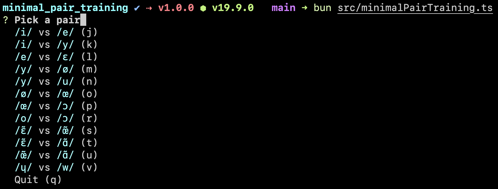

# Minimal pair training

CLI to do [minimal pair training](https://en.wikipedia.org/wiki/Minimal_pair#Teaching), for learning how to pronounce another language. This repository is currently designed for learning French, but could easily be adapted to other languages.



## Installation

```sh
pnpm install
```

## How to run

I like to use [`bun`](https://bun.sh/):

```sh
bun src/minimalPairTraining.ts
```

## Acknowledgements

- Minimal pairs come from http://minimalpairs.net/en/fr
  ([via the internet archive](https://web.archive.org/web/20200804073656/minimalpairs.net/en/fr)). See [this answer](https://linguistics.stackexchange.com/a/11634) for more on how they were generated.
- Recordings come from [Wikimedia commons](https://commons.wikimedia.org)
